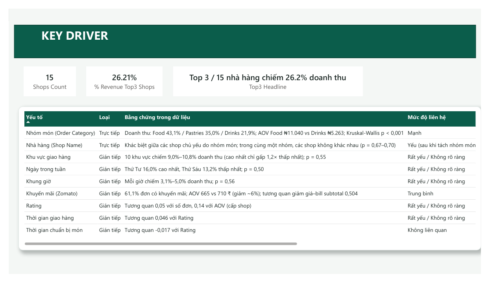
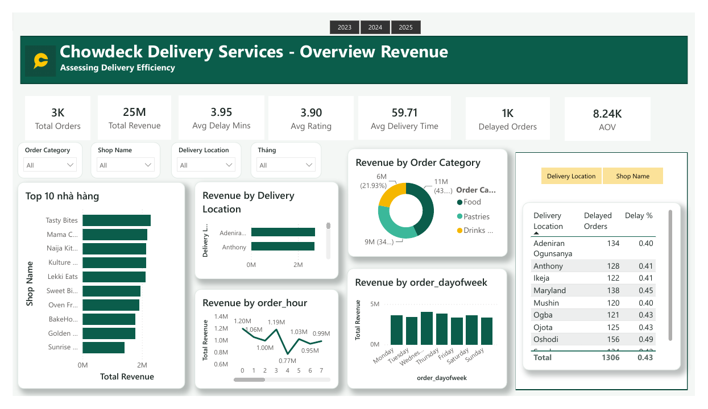
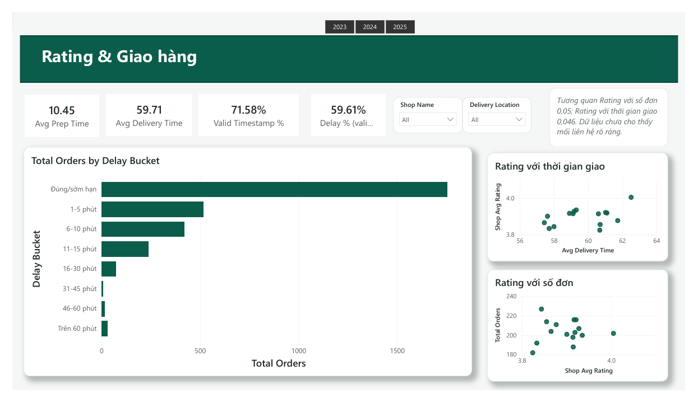
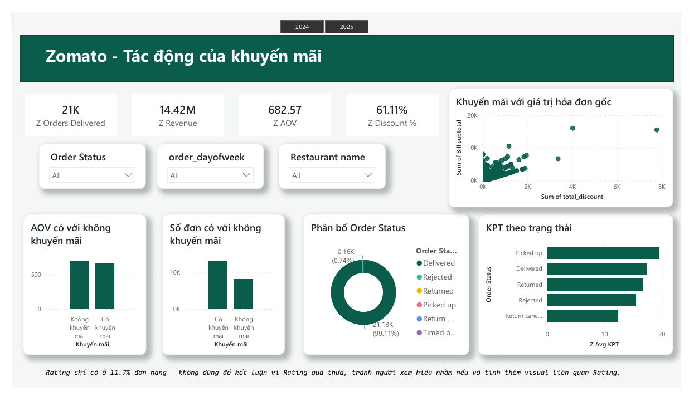
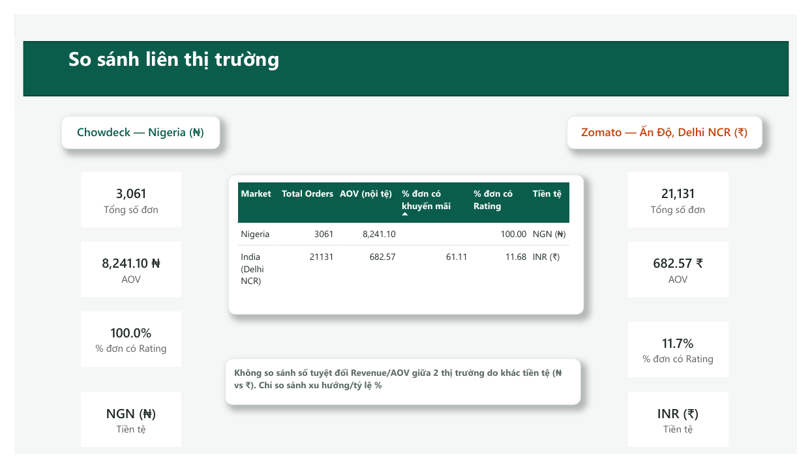

# Analysis of Factors Affecting Restaurant Revenue on Food Delivery Platforms

### Phân tích các yếu tố ảnh hưởng đến doanh thu nhà hàng trên nền tảng giao đồ ăn

## Mục tiêu dự án

Phân tích dữ liệu đơn hàng để khám phá các yếu tố có mối liên hệ với doanh thu nhà hàng trên nền tảng giao đồ ăn, từ đó đưa ra đề xuất kinh doanh dựa trên dữ liệu.

Chi tiết: xem [`docs/project_objectives.md`](docs/project_objectives.md) và [`docs/business_questions.md`](docs/business_questions.md).

## Dashboard Power BI

File dashboard: [`powerbi/Dashboard_projectNITC.pbix`](powerbi/Dashboard_projectNITC.pbix) · Bản PDF 5 trang: [`powerbi/Dashboard_projectNITC.pdf`](powerbi/Dashboard_projectNITC.pdf)

| Trang                  | Nội dung                                                                                                                          |
| ---------------------- | ---------------------------------------------------------------------------------------------------------------------------------- |
| Key Drivers            | Bảng tổng hợp mức độ liên hệ của từng yếu tố với doanh thu, cùng chỉ số tập trung doanh thu của Top 3 nhà hàng |
| Chowdeck Revenue       | Doanh thu, AOV, số đơn theo nhóm món, giờ, thứ, khu vực, nhà hàng; độ trễ giao hàng                                  |
| Rating & Giao hàng    | Rating, thời gian chuẩn bị/giao, phân bố độ trễ                                                                            |
| Zomato                 | Doanh thu, AOV, khuyến mãi, trạng thái đơn, thời gian chuẩn bị món (KPT)                                                 |
| So sánh thị trường | So sánh các KPI dạng tỷ lệ giữa Nigeria và Ấn Độ (không so sánh số tuyệt đối giữa ₦ và ₹)                      |

### Ảnh chụp dashboard

| Key Drivers                                         | Chowdeck Revenue                                              |
| --------------------------------------------------- | ------------------------------------------------------------- |
|  |  |

| Rating & Giao hàng                                             | Zomato                                    |
| --------------------------------------------------------------- | ----------------------------------------- |
|  |  |

| So sánh thị trường                                               |
| -------------------------------------------------------------------- |
|  |

> Khi mở `.pbix`, cần sửa tham số `DataFolder` (Home → Transform data → Manage Parameters) thành thư mục trên máy bạn chứa đủ 4 file CSV: `chowdeck_clean.csv`, `zomato_clean.csv` (trong `data/clean/`) và `chowdeck_kpi_summary.csv`, `zomato_kpi_summary.csv` (trong `outputs/kpi_summary/`), rồi bấm Refresh.

## Dataset sử dụng (2 dataset)

| Dataset                         | Thị trường        | Vai trò                                                                                     | Nguồn                                                                                |
| ------------------------------- | -------------------- | -------------------------------------------------------------------------------------------- | ------------------------------------------------------------------------------------- |
| Chowdeck Order Delivery Details | Nigeria              | Phân tích chính: Revenue, AOV, Rating, thời gian giao hàng, khu vực, khung giờ        | Nội bộ project                                                                      |
| Zomato Order History            | Ấn Độ (Delhi NCR) | Phân tích bổ sung: tác động của khuyến mãi lên số đơn & AOV, trạng thái đơn | [Kaggle](https://www.kaggle.com/datasets/sujalsuthar/food-delivery-order-history-data) |

Chi tiết cấu trúc dữ liệu: `docs/data_dictionary_chowdeck.md`, `docs/data_dictionary_zomato.md`.

## Kết quả chính (sơ bộ)

> Tất cả kết quả dưới đây chỉ phản ánh **mối liên hệ (correlation)** trong dữ liệu quan sát, không khẳng định quan hệ nhân quả.

**Chowdeck (sau khi lọc còn Food / Drinks & Beverages / Pastries)**

- 3.061 đơn, doanh thu ₦25,2 triệu, AOV nhà hàng ≈ ₦8.241.
- Số đơn giữa 3 nhóm món gần như bằng nhau (985–1.051 đơn), nên **chênh lệch doanh thu giữa các nhóm đến từ AOV**: Food ≈ ₦11.040, Pastries ≈ ₦8.605, Drinks ≈ ₦5.263.
- **Rating có liên hệ rất yếu** với doanh thu (tương quan cấp nhà hàng: 0,05 với số đơn, 0,14 với AOV).
- **Nhóm món** là yếu tố duy nhất khác biệt rõ về giá trị đơn (ANOVA p < 0,001), nhưng chỉ giải thích khoảng 9% biến thiên giá trị đơn. Trong cùng một nhóm món, các nhà hàng **không khác nhau** (p ≈ 0,67–0,70); chênh lệch giữa các shop chủ yếu do mỗi shop thuộc một nhóm món khác nhau.
- **Khu vực giao, thứ trong tuần, khung giờ, Rating** không cho thấy khác biệt có ý nghĩa thống kê về giá trị đơn (ANOVA p lần lượt ≈ 0,55; 0,50; 0,56), kể cả sau khi kiểm soát nhóm món (p > 0,6).

**Zomato (chỉ tính đơn `Delivered`)**

- 21.131 đơn, doanh thu ₹14,42 triệu, AOV ≈ ₹683.
- 61,1% đơn có khuyến mãi; AOV của đơn có khuyến mãi (₹665) thấp hơn đơn không có (₹710).
- Dữ liệu không có nhóm đối chứng hay biến động theo thời gian, nên **chưa đủ cơ sở kết luận khuyến mãi tạo thêm đơn**.

**Machine Learning:** Random Forest phân loại "đơn giá trị cao" (Chowdeck: Accuracy 77,5%, CV 76,2%; Zomato: 68,5%, CV 68,5%). Kiểm tra bổ sung (baseline, ablation, permutation importance) cho thấy ở Chowdeck model gần như không học thêm gì ngoài `Order Category`; ở Zomato `KPT duration` đóng góp rõ nhất. Xem `docs/ml_summary.md` (kèm các giới hạn diễn giải).

## Cấu trúc thư mục

```
├── data/
│   ├── raw/            # Dữ liệu gốc, không chỉnh sửa
│   └── clean/          # Dữ liệu sau khi làm sạch (output từ notebooks/)
├── notebooks/          # Pipeline phân tích (xem bảng bên dưới)
├── docs/               # Business questions, objectives, data dictionary, cleaning plan, KPI, ML summary, giải thích code
├── outputs/
│   ├── charts/         # Biểu đồ EDA & ML (PNG)
│   └── kpi_summary/    # Bảng KPI tổng hợp mỗi dataset
├── powerbi/            # Dashboard Power BI (.pbix, PDF, ảnh chụp 5 trang)
├── report/             # Báo cáo (project_report.md) & outline thuyết trình (presentation_outline.md) — bản nháp
└── requirements.txt
```

## Notebook

| Thứ tự | Notebook                                                                  | Nội dung                                                                                                                 |
| -------- | ------------------------------------------------------------------------- | ------------------------------------------------------------------------------------------------------------------------- |
| 1        | `01a_chowdeck_cleaning` → `01b_chowdeck_eda` → `01c_chowdeck_kpi` | Chowdeck: làm sạch, EDA, KPI                                                                                            |
| 2        | `02a_zomato_cleaning` → `02b_zomato_eda` → `02c_zomato_kpi`       | Zomato: làm sạch, EDA, KPI                                                                                              |
| 3        | `03_chowdeck_ml`                                                        | Random Forest + Cross-Validation + SHAP (Chowdeck)                                                                        |
| 4        | `04_zomato_ml`                                                          | Random Forest + Cross-Validation + SHAP (Zomato)                                                                          |
| 5        | `05_statistical_tests`                                                  | Kiểm định thống kê (ANOVA, Kruskal-Wallis, Mann-Whitney, eta²) cho các yếu tố ảnh hưởng đến giá trị đơn |

## Tiến độ hiện tại

- [X] Business questions & objectives
- [X] Data dictionary
- [X] Data cleaning plan
- [X] Data cleaning + EDA bằng Python
- [X] Định nghĩa KPI chính thức (`docs/kpi_definitions.md`)
- [X] Power BI dashboard
- [X] Machine Learning (Random Forest + Cross-Validation + SHAP)
- [X] Key insights & Business recommendations (`docs/key_insights.md`, `docs/recommendations.md`)
- [ ] Báo cáo & thuyết trình cuối cùng (bản nháp đã có trong `report/`, cần rà soát sau khi sửa dashboard)

## Cách chạy lại notebook

```bash
pip install -r requirements.txt
jupyter notebook
```

Mở notebook trong Jupyter/VS Code, chọn kernel đã cài thư viện rồi **Run All**. Chạy theo thứ tự trong bảng trên (notebook 01a/02a tạo ra file trong `data/clean/` cho các notebook sau). Notebook tự tìm đúng đường dẫn `data/raw/`; biểu đồ hiện inline và được lưu vào `outputs/charts/`.

## KPI chính

```
Revenue = Number of Orders × AOV
AOV (nhà hàng) = Total Revenue / Total Orders
```

Chowdeck tách riêng **AOV nhà hàng** (từ `Sub Total`) và **AOV khách hàng** (từ `Total`, gồm phí ship/dịch vụ). Xem chi tiết `docs/kpi_definitions.md`.

## Giới hạn dữ liệu (Limitations)

- Chowdeck: ≈ 28–29% đơn có thứ tự timestamp giao hàng không hợp lệ (đã đánh dấu bằng cột `time_sequence_valid`, không xóa). Ở nhóm này `delay_min` ≈ 0 nên các KPI độ trễ chỉ tính trên đơn hợp lệ (`*_valid_only` trong `chowdeck_kpi_summary.csv`). Không có dữ liệu khuyến mãi, số lượng review hay đơn hủy. Đã lọc bỏ nhóm Groceries/Medications (Groceries là nhóm có doanh thu cao nhất trong dữ liệu gốc), chỉ giữ Food/Drinks & Beverages/Pastries. Rating chỉ có 5 mức (3,0–5,0), cần thận trọng khi diễn giải.
- Zomato: Rating thiếu 88,3% (không điền giá trị giả). Chỉ 6 nhà hàng. Dữ liệu chỉ trong 5 tháng (09/2024–01/2025). Revenue/AOV chỉ tính trên đơn `Delivered`.
- Không gộp 2 dataset ở tầng dữ liệu thô (khác tiền tệ, khác thị trường), chỉ so sánh ở mức KPI tổng hợp. Không cộng hay so sánh trực tiếp số tuyệt đối giữa ₦ và ₹.
- Machine Learning: `Order Category` và `Shop Name` gần như quyết định mức giá nên đứng đầu về mức độ quan trọng là điều dễ hiểu, không phải phát hiện mới. Model chỉ dùng để xếp hạng tương đối giữa các yếu tố, không dùng để dự đoán chính xác từng đơn.
- Không có dữ liệu chi phí nên không đánh giá được lợi nhuận.
- Mọi kết luận chỉ dừng ở mức tương quan (correlation), không khẳng định quan hệ nhân quả (causation).

## Thành viên nhóm

- Nguyễn Minh Hiếu
- Trần Thị Huyền Trang
