# Báo cáo dự án Data Analyst

# Analysis of Factors Affecting Restaurant Revenue on Food Delivery Platforms
### Phân tích các yếu tố ảnh hưởng đến doanh thu nhà hàng trên nền tảng giao đồ ăn

**Nhóm thực hiện:** Nguyễn Minh Hiếu, Trần Thị Huyền Trang
**Công cụ:** Python (Pandas, Matplotlib, Seaborn, SciPy, scikit-learn, SHAP), Power BI, GitHub
**Mã nguồn:** `restaurant-revenue-da-project`

> **Lưu ý đọc báo cáo:** mọi kết luận chỉ ở mức **mối liên hệ (correlation)** trong dữ liệu quan sát, không khẳng định quan hệ nhân quả. Hai dataset khác thị trường và tiền tệ (₦ và ₹) nên không so sánh số tuyệt đối giữa chúng.

---

## 1. Tóm tắt điều hành

**Câu hỏi:** những yếu tố nào có liên hệ với doanh thu của nhà hàng trên nền tảng giao đồ ăn?

**Dữ liệu:** Chowdeck (Nigeria, 3.061 đơn Food/Drinks/Pastries, phân tích chính) và Zomato (Delhi NCR, 21.131 đơn đã giao, phân tích bổ sung về khuyến mãi).

**Kết quả chính:**

1. Doanh thu = Số đơn × AOV, và AOV gần như do **giá món × số lượng** quyết định (giải thích ≈ 89% biến thiên giá trị đơn Chowdeck, gần như là định nghĩa).
2. Trong các yếu tố ngữ cảnh có sẵn, **chỉ nhóm món** có liên hệ rõ với giá trị đơn, và cũng chỉ giải thích khoảng **9%**. Số đơn giữa 3 nhóm gần bằng nhau (985–1.051); chênh lệch doanh thu đến từ AOV (Food ₦11.040, Pastries ₦8.605, Drinks ₦5.263).
3. **Nhà hàng, khu vực, ngày, giờ và Rating không có liên hệ đáng kể** với giá trị đơn (p > 0,6 sau khi kiểm soát nhóm món). Trong cùng một nhóm, các shop không khác nhau (p = 0,67–0,70).
4. **Khuyến mãi (Zomato):** đơn có khuyến mãi đi cùng hóa đơn gốc lớn hơn (₹797 so với ₹676) nhưng khách trả ít hơn mỗi đơn (₹665 so với ₹710). Dữ liệu không đủ để kết luận khuyến mãi tạo thêm đơn.
5. **Chất lượng dữ liệu là hạn chế lớn:** ≈ 28% đơn Chowdeck có timestamp sai thứ tự; 88,3% đơn Zomato không có Rating; không có dữ liệu chi phí nên không đánh giá được lợi nhuận.

**Đề xuất chính:** tập trung vào **tăng giá trị mỗi đơn** (combo, bán kèm) thay vì nhắm theo khu vực hay giờ; chạy thử nghiệm có đối chứng trước khi mở rộng khuyến mãi; theo dõi Orders × AOV hằng tháng; cải thiện chất lượng dữ liệu.

---

## 2. Bối cảnh và mục tiêu

### 2.1 Bối cảnh
Trên các nền tảng giao đồ ăn, nhà hàng thường tập trung vào Rating, khuyến mãi và tốc độ giao hàng để tăng doanh thu. Dự án kiểm tra bằng dữ liệu thực xem các yếu tố này có thật sự liên hệ với doanh thu hay không.

### 2.2 Mục tiêu
1. Khám phá các yếu tố có mối liên hệ với doanh thu.
2. Phân biệt yếu tố **trực tiếp** (số đơn, AOV, giá món), **gián tiếp** (Rating, thời gian, khu vực, khung giờ, khuyến mãi, nhóm món) và yếu tố ảnh hưởng **lợi nhuận** thay vì doanh thu (chi phí, hoa hồng, chi phí khuyến mãi).
3. Đề xuất hành động dựa trên dữ liệu, nêu rõ giới hạn.

### 2.3 Câu hỏi kinh doanh
| # | Câu hỏi | Dataset |
|---|---|---|
| 1 | Nhà hàng nào có doanh thu và AOV cao nhất? | Chowdeck |
| 2 | Nhóm món nào đóng góp doanh thu nhiều nhất? | Chowdeck |
| 3 | Rating có liên hệ với số đơn hoặc AOV không? | Chowdeck |
| 4 | Thời gian giao/chuẩn bị có liên quan đến Rating không? | Chowdeck |
| 5 | Khu vực giao hàng nào có doanh thu cao nhất? | Chowdeck |
| 6 | Khung giờ/ngày nào có doanh thu cao nhất? | Chowdeck |
| 7 | Đơn có khuyến mãi có nhiều hơn đơn không khuyến mãi không? | Zomato |
| 8 | Đơn có khuyến mãi có AOV thấp hơn không? | Zomato |
| 9 | Đơn bị từ chối/hủy có liên quan đến thời gian chuẩn bị (KPT) không? | Zomato |

### 2.4 Công thức trọng tâm
```
Revenue = Number of Orders × AOV
AOV = Total Revenue / Total Orders
```

---

## 3. Dữ liệu

| | Chowdeck | Zomato |
|---|---|---|
| Thị trường | Nigeria (Lagos), ₦ | Ấn Độ (Delhi NCR), ₹ |
| Vai trò | Phân tích chính | Phân tích bổ sung (khuyến mãi) |
| Quy mô gốc | 5.000 đơn, 27 cột, 2023–2025 | 21.321 đơn, 29 cột, 09/2024–01/2025 |
| Sau xử lý | 3.061 đơn | 21.131 đơn `Delivered` (tính Revenue/AOV) |
| Số nhà hàng | 15 shop (5 shop mỗi nhóm) | 6 nhà hàng |
| Nguồn | *(điền nguồn và giấy phép)* | Kaggle: Food Delivery Order History Data |

**Quyết định về phạm vi (đã chốt):**
- Chowdeck: lọc bỏ **Groceries (963 đơn)** và **Medications (976 đơn)** vì không phải đồ ăn, giữ Food, Drinks & Beverages, Pastries. *Lưu ý: Groceries là nhóm có doanh thu cao nhất trong dữ liệu gốc.*
- Hai dataset được làm sạch và phân tích **riêng biệt**, chỉ so sánh ở mức KPI tổng hợp.
- Chowdeck: Revenue của nhà hàng = `Sub Total` (không gồm phí giao và phí dịch vụ). Zomato: Revenue = `Total` của đơn `Delivered`, là số khách trả sau khuyến mãi, chỉ là ước lượng vì một phần khuyến mãi có thể do nền tảng tài trợ.

---

## 4. Phương pháp

### 4.1 Làm sạch dữ liệu
**Chowdeck**
- Chuẩn hóa tên cột (khoảng trắng thừa ở `Sub Total `, `Total `...).
- Kiểm tra thứ tự 8 mốc thời gian của đơn, đánh dấu bằng `time_sequence_valid` (không xóa dòng).
- Tạo biến phái sinh: `prep_time_min`, `delivery_time_min`, `delay_min`, `order_hour`, `order_dayofweek`, `order_month`, `order_year`, `revenue`.
- Loại cột không phục vụ phân tích: `Delivery PIN`, `Url`.

**Zomato**
- Bỏ các cột thiếu quá nhiều (>95%) hoặc chỉ có một giá trị.
- Rating thiếu 88,3%: **không điền giá trị giả**, chỉ phân tích trên phần có rating.
- Chuyển `Distance` từ text sang số (`<1km` quy ước là 1 km).
- Điền `Discount construct` thiếu bằng "No Discount"; tạo `total_discount` và `has_discount`.
- Revenue/AOV chỉ tính trên đơn `Delivered`.

### 4.2 Phát hiện chất lượng dữ liệu
| Vấn đề | Chi tiết | Cách xử lý |
|---|---|---|
| Timestamp Chowdeck sai thứ tự | 870/3.061 đơn (≈ 28%) | Đánh dấu, giữ lại; KPI thời gian tính trên đơn hợp lệ |
| `delay_min` ở đơn lỗi | Bằng 0 ở 99,4% dòng (giờ giao trùng giờ dự kiến) nên không phản ánh thực tế | KPI độ trễ tính riêng trên đơn hợp lệ (`*_valid_only`) |
| Rating Chowdeck | Chỉ 5 mức (3,0–5,0), dữ liệu có dấu hiệu mô phỏng | Nêu rõ trong hạn chế |
| Rating Zomato | Thiếu 88,3% | Chỉ dùng mô tả, không kết luận mạnh |

### 4.3 Phương pháp phân tích
- **EDA** và KPI bằng Pandas; biểu đồ bằng Matplotlib và Seaborn.
- **Kiểm định thống kê:** ANOVA và Kruskal–Wallis để so sánh giá trị đơn giữa các nhóm (nhóm món, shop, khu vực, thứ, giờ); kiểm tra riêng ảnh hưởng của shop **trong từng nhóm món** để tránh nhầm hiệu ứng nhóm món với hiệu ứng nhà hàng; hồi quy OLS để ước lượng phần biến thiên (R²) mà từng yếu tố giải thích.
- **Dashboard** Power BI gồm các trang: Key Drivers, Chowdeck (tổng quan, Rating và thời gian giao), Zomato (khuyến mãi) và so sánh liên thị trường.
- **Machine Learning:** Random Forest phân loại "đơn giá trị cao" (trên median) để xếp hạng tương đối mức quan trọng của các yếu tố; không dùng Unit Price, Quantity hay Bill subtotal làm input (tránh rò rỉ dữ liệu).

---

## 5. Kết quả phân tích Chowdeck

### 5.1 Tổng quan KPI
| KPI | Giá trị |
|---|---|
| Số đơn | 3.061 |
| Doanh thu (Sub Total) | ₦25.226.000 |
| AOV nhà hàng | ₦8.241 |
| AOV khách hàng (gồm phí) | ₦9.413 |
| Rating trung bình | 3,90 |

### 5.2 Doanh thu theo năm (BQ: xu hướng)
| Năm | Số đơn | AOV (₦) | Doanh thu (₦) |
|---|---|---|---|
| 2023 | 1.067 | 8.473 | 9.041.000 |
| 2024 | 983 | 8.032 | 7.895.500 |
| 2025 | 1.011 | 8.199 | 8.289.500 |

2023→2024 doanh thu −12,7% (số đơn −7,9%, AOV −5,2%); 2024→2025 +5,0% (số đơn +2,8%, AOV +2,1%). **Chênh lệch giá trị đơn giữa các năm không có ý nghĩa thống kê (p = 0,44)**, nên đây có thể chỉ là dao động ngẫu nhiên.

### 5.3 BQ#2: Nhóm món
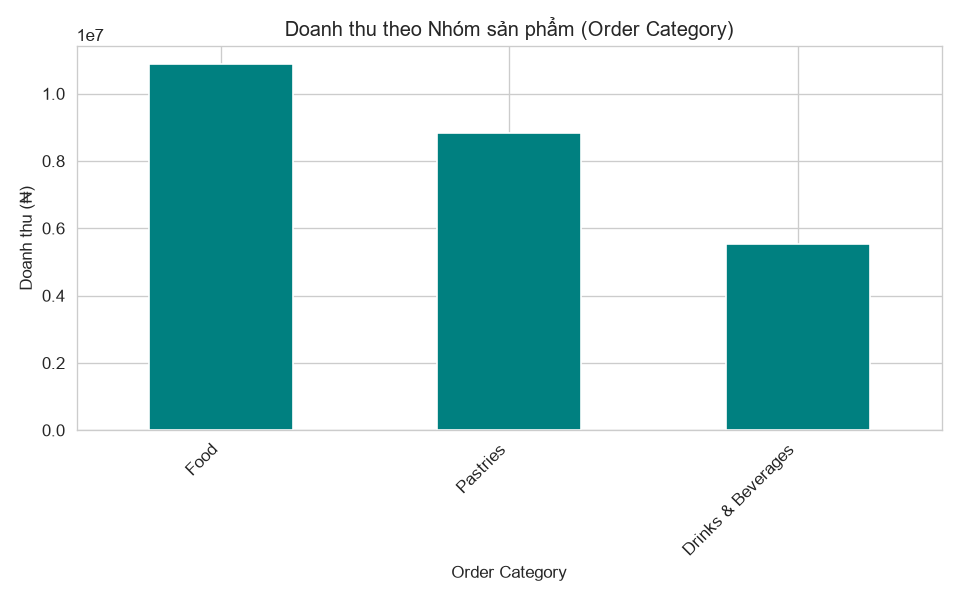

| Nhóm món | Số đơn | AOV (₦) | Tỷ trọng doanh thu |
|---|---|---|---|
| Food | 985 | 11.040 | 43,1% |
| Pastries | 1.025 | 8.605 | 35,0% |
| Drinks & Beverages | 1.051 | 5.263 | 21,9% |

Drinks có nhiều đơn nhất nhưng doanh thu thấp nhất. **Chênh lệch doanh thu giữa các nhóm đến từ AOV, không phải số đơn.** Nhóm món là yếu tố duy nhất có khác biệt rõ (p < 0,001) nhưng chỉ giải thích khoảng 9% biến thiên giá trị đơn.

### 5.4 BQ#1: Nhà hàng
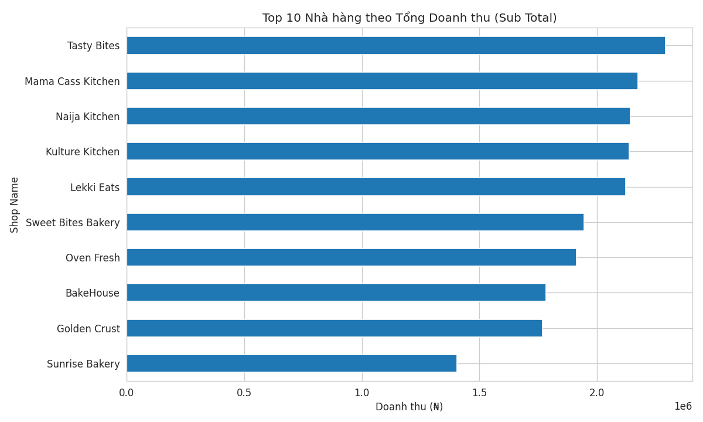

Shop doanh thu cao nhất là **Tasty Bites** (₦2,29 triệu, nhóm Food); AOV cao nhất là **Naija Kitchen** (₦11.399). Tuy nhiên:
- Thứ hạng giữa các shop gần như hoàn toàn theo **nhóm món** của shop (5 shop Food đứng đầu, rồi Pastries, rồi Drinks).
- **Trong cùng một nhóm, các shop không khác nhau về giá trị đơn** (ANOVA p = 0,67 Food; 0,70 Drinks; 0,69 Pastries). Thêm tên shop vào mô hình sau khi đã có nhóm món chỉ tăng R² từ 9,0% lên 9,2%.
- Doanh thu cấp shop tương quan 0,98 với AOV của shop và −0,26 với số đơn.

**Kết luận BQ#1:** có thể xếp hạng nhà hàng, nhưng khác biệt giữa các nhà hàng cùng nhóm món chưa vượt quá mức ngẫu nhiên.

### 5.5 BQ#3: Rating
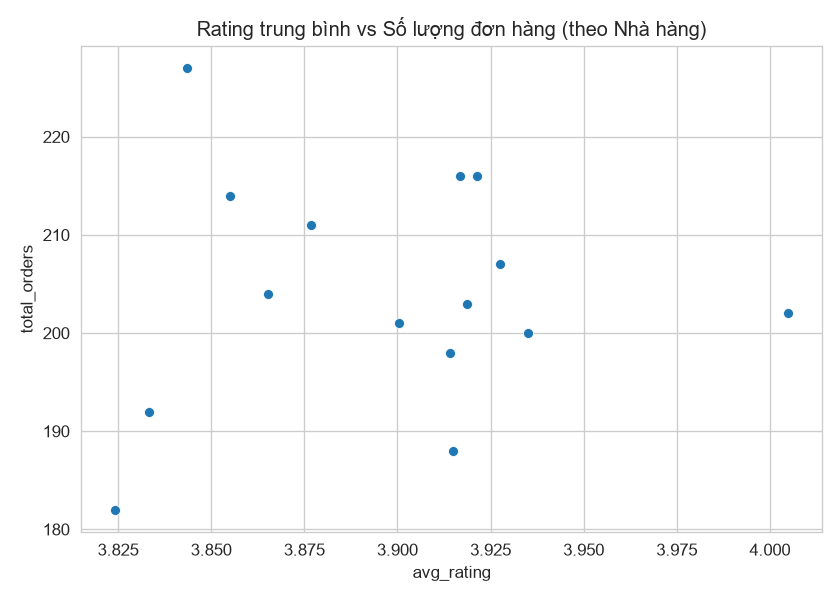

Tương quan cấp nhà hàng giữa Rating và số đơn là 0,05, giữa Rating và AOV là 0,14. Ở cấp đơn hàng, Rating giải thích gần 0% biến thiên giá trị đơn (p = 0,60 khi đã kiểm soát nhóm món). **Dữ liệu không ủng hộ giả thuyết "Rating cao thì bán chạy hơn" ở dataset này.** Cần thận trọng vì Rating chỉ có 5 mức.

### 5.6 BQ#4: Thời gian giao hàng và chuẩn bị
- Chuẩn bị trung bình ≈ 10,5 phút; giao ≈ 61,3 phút (đơn hợp lệ).
- Trên đơn hợp lệ (2.191 đơn): **59,6% giao sau thời điểm dự kiến**, trễ trung bình 5,5 phút (trung vị 3 phút).
- Tương quan với Rating gần 0: thời gian giao 0,02; chuẩn bị −0,02; độ trễ 0,06.
- **Bất thường:** đơn trễ lại có Rating cao hơn đơn không trễ (4,10 so với 3,82). Kết quả trái trực giác nên **không dùng làm insight**, cần kiểm tra thêm cách ghi nhận dữ liệu.

### 5.7 BQ#5: Khu vực giao hàng
10 khu vực có doanh thu phân bố gần đều: cao nhất Adeniran Ogunsanya (10,8% doanh thu), thấp nhất Ogba (9,0%); chênh lệch tối đa ≈ 1,2 lần. Khác biệt giá trị đơn giữa các khu vực không có ý nghĩa thống kê (ANOVA p = 0,55; không khác biệt trong từng nhóm món, p > 0,19).

### 5.8 BQ#6: Khung giờ và ngày trong tuần
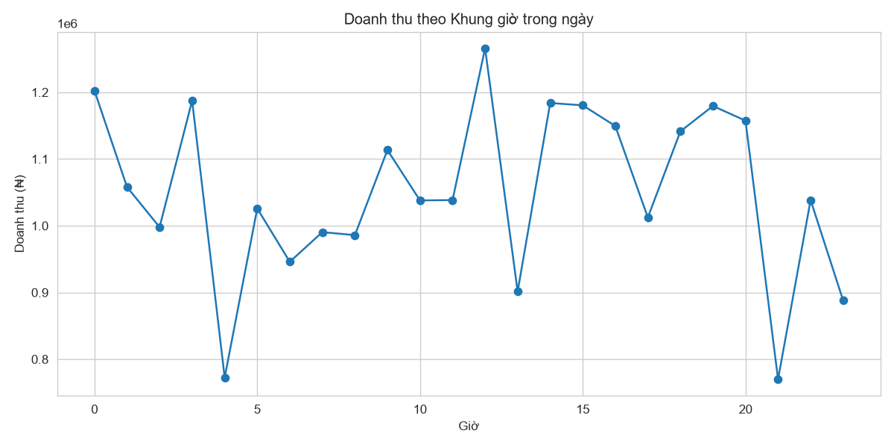
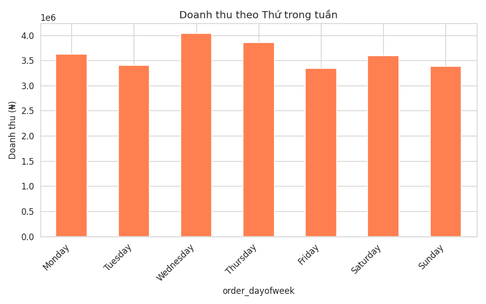

Doanh thu theo thứ cao nhất vào Thứ Tư (₦4,04 triệu) và thấp nhất vào Thứ Sáu (₦3,34 triệu), nhưng khác biệt giá trị đơn giữa các thứ (p = 0,50) và giữa các giờ (p = 0,56) **không có ý nghĩa thống kê**. Số đơn trong 4 khung giờ lớn (0–5h, 6–11h, 12–17h, 18–23h) khá đều (745, 740, 799, 777). **Chưa đủ cơ sở để kết luận có "giờ vàng" hay ngày vàng.**

### 5.9 Khách hàng
181 tài khoản; 10% tài khoản cao nhất (18 tài khoản) tạo ra **42,5% doanh thu**. Dataset không có ngày đăng ký nên không phân tích được khách mới và khách quay lại.

---

## 6. Kết quả phân tích Zomato (khuyến mãi)

### 6.1 Tổng quan
21.131 đơn `Delivered`, doanh thu ₹14,42 triệu, AOV ₹683. 99,1% đơn giao thành công, 0,74% bị từ chối. **Aura Pizzas chiếm 68,2% số đơn và 73,8% doanh thu**, nên KPI tổng chủ yếu phản ánh một nhà hàng.

### 6.2 BQ#7 và BQ#8: Khuyến mãi
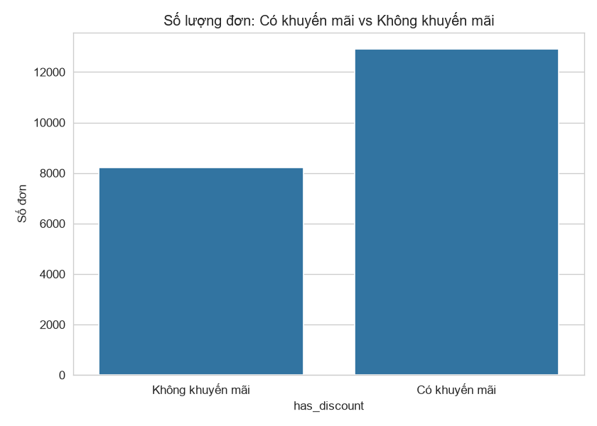
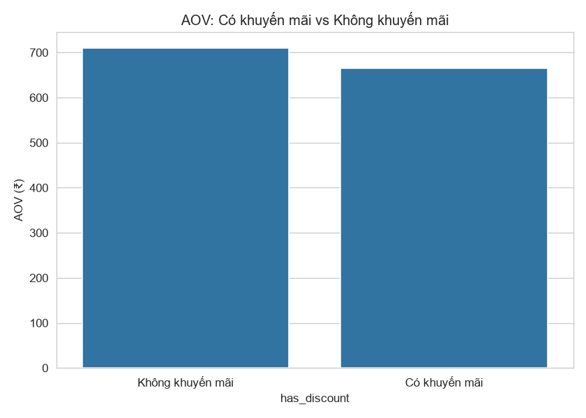

| | Có khuyến mãi | Không khuyến mãi |
|---|---|---|
| Số đơn | 12.914 (61,1%) | 8.217 (38,9%) |
| AOV theo `Total` (khách trả) | ₹665 | ₹710 |
| Hóa đơn gốc trung bình (`Bill subtotal`) | ₹797 | ₹676 |

- Đơn có khuyến mãi **nhiều hơn** về số lượng (BQ#7), và khách trả **ít hơn khoảng 6,3%** mỗi đơn (BQ#8).
- Hóa đơn gốc của đơn có khuyến mãi lại lớn hơn. Xét riêng từng nhà hàng, chiều này đúng ở 4 trong 5 nhà hàng có cả hai nhóm.
- **Không thể kết luận khuyến mãi tạo thêm đơn:** không có nhóm đối chứng hay dữ liệu trước/sau; hóa đơn lớn có thể là điều kiện để được giảm giá (chiều ngược); tương quan 0,50 giữa tiền giảm và hóa đơn một phần mang tính cơ học vì tiền giảm tính theo % hóa đơn.

### 6.3 BQ#9: Đơn bị từ chối và thời gian chuẩn bị
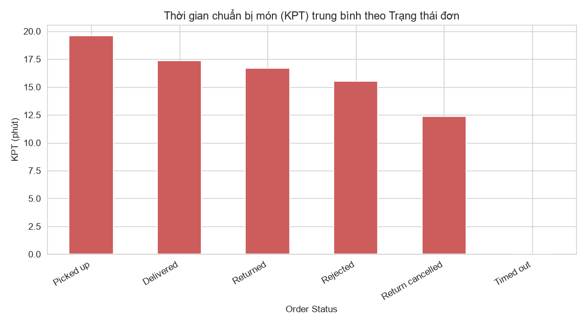

Đơn `Rejected` có KPT trung bình 15,5 phút (61 đơn có dữ liệu) so với 17,3 phút của đơn `Delivered`. **Không có bằng chứng bếp chậm đi cùng việc đơn bị từ chối**, nhưng mẫu nhỏ.

### 6.4 Các phát hiện khác
- **Giờ cao điểm:** 18–21h chiếm 43,5% số đơn, AOV cao nhất (₹734); tỷ lệ đơn có khuyến mãi ở khung này thấp nhất (56%, trong khi 0–5h là 73%).
- **Vận hành:** KPT tương quan 0,38 với hóa đơn gốc (đơn lớn nấu lâu hơn); tương quan với khoảng cách 0,11.
- **Rating:** chỉ 11,8% đơn có Rating (trung bình 4,36), tương quan 0,06 với hóa đơn, mẫu quá thưa để kết luận.
- **Khách hàng:** 33,4% khách đặt từ 2 đơn trở lên trong 5 tháng; 10% khách chi nhiều nhất tạo 37% doanh thu.

---

## 7. Dashboard Power BI

*(Chèn ảnh dashboard sau khi chỉnh sửa xong)*

| Trang | Nội dung |
|---|---|
| Key Drivers of Revenue | Bảng tổng hợp mức độ liên hệ của từng yếu tố |
| Chowdeck: Tổng quan doanh thu | KPI, doanh thu theo nhóm món, shop, khu vực, giờ, thứ |
| Chowdeck: Rating và thời gian giao | Rating theo shop, thời gian chuẩn bị và giao |
| Zomato: Tác động của khuyến mãi | Số đơn, AOV, KPT theo khuyến mãi và trạng thái |
| So sánh liên thị trường | So sánh tỷ lệ % (không so sánh số tuyệt đối khác đơn vị) |

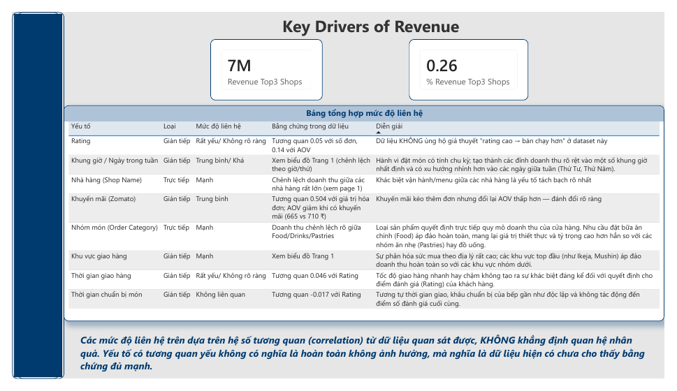
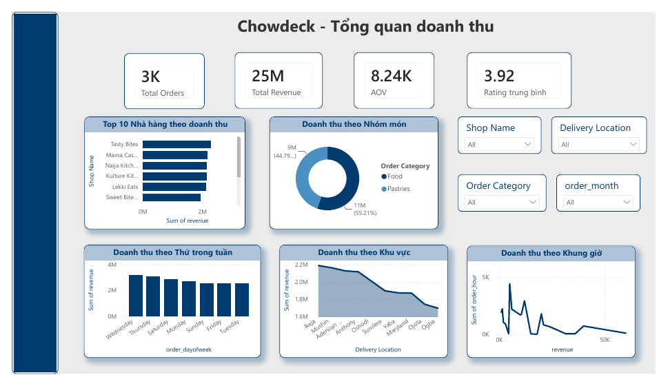

---

## 8. Mô hình Machine Learning

**Bài toán:** phân loại đơn có thuộc nhóm "giá trị cao" (trên median) hay không, từ các yếu tố ngữ cảnh. **Mô hình:** Random Forest (200 cây, max_depth = 8, class_weight = balanced), chia Train/Test 80/20, kiểm tra thêm bằng 5-fold Cross-Validation.

| | Accuracy | Precision | Recall | F1 | CV 5-fold (Accuracy) |
|---|---|---|---|---|---|
| Chowdeck | 77,5% | 82,5% | 63,4% | 71,7% | 76,2% ± 1,0% |
| Zomato | 68,5% | 68,2% | 69,1% | 68,6% | 68,5% ± 0,6% |

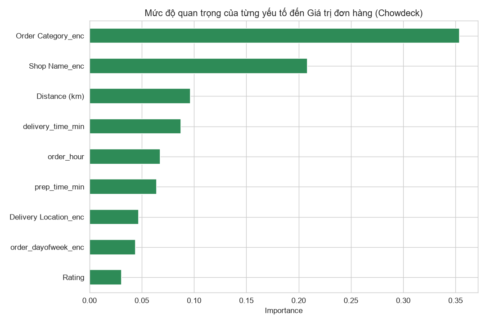
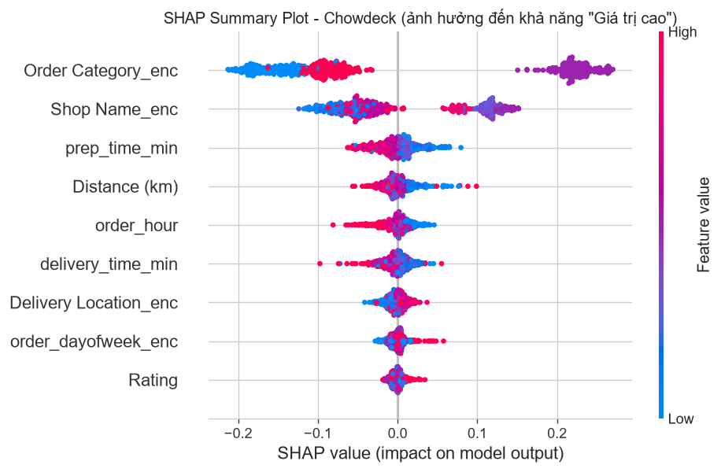

**Diễn giải:**
- **Chowdeck:** Nhóm món (35,4%) và tên shop (20,8%) đứng đầu, **nhưng đây phần lớn là điều hiển nhiên** vì chúng gần như quyết định mức giá, và `Shop Name` chỉ lặp lại thông tin của nhóm món (các shop cùng nhóm không khác nhau). Rating chỉ 3,1%.
- **Zomato:** thời gian chuẩn bị (KPT) quan trọng nhất (50,5%): đơn lớn nấu lâu hơn, đây là hệ quả vận hành. Khuyến mãi đứng thứ 3 (10,1%).
- Model chỉ dùng để **xếp hạng tương đối**, không dùng để dự đoán chính xác từng đơn, và mức quan trọng của Random Forest không chứng minh quan hệ nhân quả.
- Không đọc màu SHAP của các biến phân loại đã mã hóa (nhóm món, shop, khu vực, thứ) vì thứ tự mã số không có ý nghĩa.

---

## 9. Đề xuất kinh doanh

Mỗi đề xuất gắn với một phát hiện và ghi rõ là hành động ngay, giả thuyết cần thử nghiệm hay dữ liệu cần thu thập. Chi tiết: `docs/recommendations.md`.

| # | Đề xuất | Căn cứ | Loại |
|---|---|---|---|
| 1 | Tăng giá trị mỗi đơn ở nhóm AOV thấp (combo đồ uống + bánh, gợi ý mua kèm) | Số đơn các nhóm gần bằng nhau nhưng AOV chênh 2,1 lần | Giả thuyết cần thử nghiệm |
| 2 | Theo dõi hằng tháng Orders × AOV trên dashboard | Doanh thu 2023→2024 giảm do cả số đơn và AOV | Hành động ngay |
| 3 | Thử nghiệm có đối chứng trước khi mở rộng khuyến mãi; đo đơn tăng thêm và lợi nhuận | Khách trả ít hơn ≈ 6,3% mỗi đơn có khuyến mãi; chưa biết nhân quả | Giả thuyết cần thử nghiệm |
| 4 | Chuẩn bị năng lực bếp cho khung 18–21h | 43,5% đơn Zomato; đơn lớn nấu lâu hơn | Hành động ngay |
| 5 | Chăm sóc nhóm khách chi tiêu cao | 10% khách đầu tạo 37–42% doanh thu | Giả thuyết cần thử nghiệm |
| 6 | Không dồn ngân sách theo khu vực, giờ hay Rating khi chưa có thêm dữ liệu | Không có liên hệ đáng kể (p > 0,6) | Tránh lãng phí |
| 7 | Giảm phụ thuộc vào nhà hàng chủ lực | Aura Pizzas = 73,8% doanh thu Zomato | Quản trị rủi ro |
| 8 | Cải thiện chất lượng dữ liệu | Timestamp lỗi, Rating thiếu, không có chi phí | Dữ liệu cần thu thập |

---

## 10. Hạn chế

- **Không có dữ liệu chi phí**, nên không đánh giá được lợi nhuận hay hiệu quả thật của khuyến mãi.
- **Chowdeck:** không có khuyến mãi, review, đơn hủy; ≈ 28% timestamp sai thứ tự; Rating chỉ 5 mức; dữ liệu có dấu hiệu mô phỏng; chỉ 15 shop; đã loại Groceries và Medications.
- **Zomato:** Rating thiếu 88,3%; chỉ 6 nhà hàng, một nhà hàng chiếm 74% doanh thu; chỉ 5 tháng; Revenue (`Total`) chỉ là ước lượng.
- **Phương pháp:** dữ liệu quan sát nên không kết luận nhân quả; target ML được nhị phân hóa theo median tự chọn; model chưa tinh chỉnh tham số.
- **Khái quát hóa:** kết quả chỉ áp dụng cho hai dataset này, không đại diện cho toàn bộ nhà hàng trên nền tảng.

---

## 11. Kết luận và hướng phát triển

**Kết luận:** doanh thu mỗi đơn chủ yếu do **giá món và số lượng** quyết định. Trong các yếu tố ngữ cảnh có sẵn, chỉ **nhóm món** có liên hệ rõ, còn Rating, khu vực, giờ, ngày và nhà hàng (khi đã kiểm soát nhóm món) không cho thấy liên hệ đáng kể. Một kết quả "không tìm thấy mối liên hệ" vẫn có giá trị vì nó tránh được việc đầu tư theo những giả định không được dữ liệu ủng hộ.

**Hướng phát triển:**
1. Bổ sung dữ liệu chi phí để phân tích **lợi nhuận** thay vì chỉ doanh thu.
2. Thu thập dữ liệu có nhóm đối chứng để đánh giá nhân quả của khuyến mãi (A/B test).
3. Làm sạch timestamp và tăng độ phủ Rating.
4. Mở rộng sang nhiều nhà hàng và nhiều khoảng thời gian hơn.
5. Phân tích khách hàng (khách mới và quay lại, giá trị vòng đời) khi có ngày đăng ký.

---

## Phụ lục

### A. Tái lập kết quả
```bash
pip install -r requirements.txt
```
Chạy lần lượt: `01a → 01b → 01c` (Chowdeck), `02a → 02b → 02c` (Zomato), `03_chowdeck_ml`, `04_zomato_ml`. Chi tiết trong `README.md`.

### B. Danh sách tài liệu
`docs/business_questions.md`, `docs/project_objectives.md`, `docs/data_dictionary_*.md`, `docs/data_cleaning_plan_*.md`, `docs/kpi_definitions.md`, `docs/key_insights.md`, `docs/recommendations.md`, `docs/ml_summary.md`, `docs/dashboard_fixes.md`.
